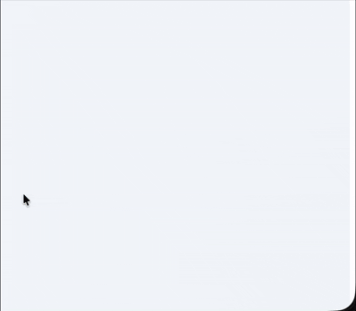

# ngx-toast 🍞

A lightweight, high-performance, and **Zoneless-ready** toast notification library for Angular 21+.

[](https://angular.dev/)
[](https://github.com/aminekun90/ngx-toast/graphs/commit-activity)
[](https://github.com/aminekun90/ngx-toast/releases)
[](https://github.com/aminekun90/ngx-toast/actions)
[](https://github.com/aminekun90/ngx-toast/blob/main/LICENSE)

[](https://socket.dev/npm/package/@aminekun90/ngx-toast)
[](https://www.npmjs.com/package/@aminekun90/ngx-toast)

{ style="display: block; margin: 0 auto" }

## Key Features

* ⚡ **Angular 21+ Optimized**: Fully supports `provideZonelessChangeDetection()`.
* 📡 **Signal-based**: Built with Angular Signals for reactive and efficient state management.
* 🎨 **FontAwesome Integration**: Built-in support for professional iconography.
* 🛠 **Customizable**: Easy control over duration, progress bars, and screen positions.
* 📦 **Yarn 4 Ready**: Developed and optimized using modern Yarn Berry.

---

## Installation

Install the package via **Yarn**:

```bash
yarn add ngx-toast
```

## Peer Dependencies

Since the library uses FontAwesome for its visual components, ensure the following are installed in your project:

```bash
yarn add @fortawesome/angular-fontawesome @fortawesome/fontawesome-svg-core @fortawesome/free-solid-svg-icons
```

---

## Configuration

Add the necessary providers to your app.config.ts (or config.ts). It is highly recommended to use provideAnimationsAsync() for smooth transitions.

```ts
import { ApplicationConfig } from '@angular/core';
import { provideAnimationsAsync } from '@angular/platform-browser/animations/async';
import { FaIconLibrary } from '@fortawesome/angular-fontawesome';
import { fas } from '@fortawesome/free-solid-svg-icons';

export const appConfig: ApplicationConfig = {
  providers: [
    provideAnimationsAsync(),
    {
      provide: 'INITIALIZE_FA',
      useFactory: (library: FaIconLibrary) => library.addIconPacks(fas),
      deps: [FaIconLibrary]
    }
  ]
};
```

---

## Usage

### 1. Add the Global Container

Place the ngx-toast-container in your root component (app.ts or app.component.html). This container will handle the stacking and positioning of all active toasts.

```ts
import { ToastContainerComponent } from 'ngx-toast';

@Component({
  selector: 'app-root',
  standalone: true,
  imports: [ToastContainerComponent],
  template: `
    <router-outlet></router-outlet>
    <ngx-toast></ngx-toast>
  `
})
export class App {}

```

### 2. Triggering Notifications

```ts

import { Component, inject } from '@angular/core';
import { ToastService } from 'ngx-toast';

@Component({ ... })
export class MyComponent {
  private toastService = inject(ToastService);

  showSuccess() {
    this.toastService.show({
      type: 'success',
      title: 'Success!',
      message: 'The operation was completed successfully.',
      duration: 3000,
      progressBar: true,
      position: 'bottom-right'
    });
  }
}
```

## API Reference

| Property | Type | Default | Description |
| -------- | ---- | ------- | ----------- |
| type | 'success' \| 'error' \| 'warning' \| 'info' | 'info' | Defines the visual theme and icon of the toast. |
| title | string | undefined | Optional bold heading displayed above the message. |
| message | string | "" | The primary text content of the notification. |
| duration | number | 5000 | Time in milliseconds before auto-close (0 for infinite). |
| progressBar | boolean | false | If true, displays a visual countdown |

## Compatibility

| ngx-toast | Angular Version | Node.js Version | Change Detection   |
|-----------|-----------------|-----------------|--------------------|
| 1.0.x     | ^21.2.0         | ^22.x \| ^24.x  | Zoneless & Zone.js |

This library is built with Angular 21 and above.
Node 24.13.0 or higher is required.

## Keep this project alive :coffee:

I dedicate time and effort on writing and maintaining this library and if it helped you and saved you time, please consider Donating!

I'm grateful for your support.

[Donate via PayPal](paypal.me/aminebouzahar)

[](https://www.paypal.com/paypalme/aminebouzahar)

## Licence

MIT License, By Amine Bouzahar.
